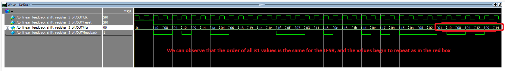

# Something about the CPEN 311 Lab 5

## Something about the SOF file
It is located here:  
[./rtl/dds_and_nios_lab_time_limited.sof](./rtl/dds_and_nios_lab_time_limited.sof)

## Something about the status
All parts complete, including:  
* LFSR
* (PACO FILL IN WHAT YOU HAVE DONE)  

Complete with simulations and SignalTaps

## Annotated Simulation screenshots
[./docs](./docs)  
They are partitioned by task. Inside, you will find simulation screenshots and SignalTap screenshots.  

LFSR:
 

PACO ADD HERE

## Annotated SignalTap screenshots
[./docs](./docs)  
They are partitioned by task. Inside, you will find simulation screenshots and SignalTap screenshots. 

LFSR:

PACO ADD HERE

## Additional Information
None
